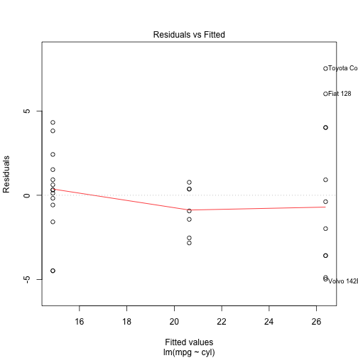
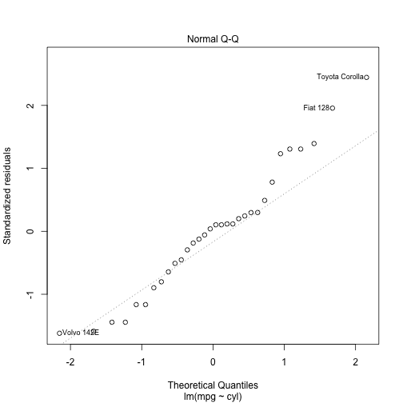
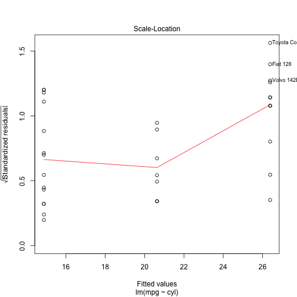
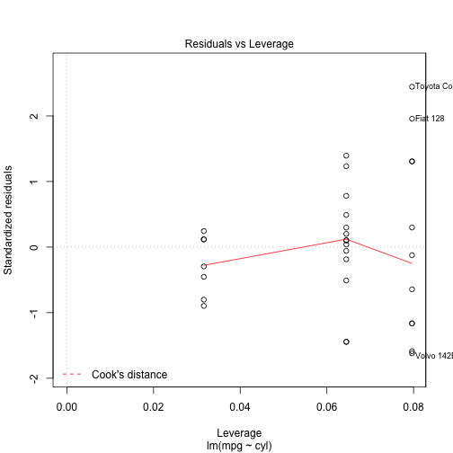

## Shiny App Input and Output

The Shiny App uses the mtcars dataset and allows user to select a variable to run a liner regression model.

To run the app:

Select the varible you want to run regression for from 
  1. Number of cylinders
  2. Transmission
  3. Gears
  4. Carburetors

Click Submit

--- 

## mtcars dataset

Motor Trend Car Road Tests : The data was extracted from the 1974 Motor Trend US magazine and comprises fuel consumption and 10 aspects of automobile design and performance for 32 automobiles (1973–74 models).

A data frame with 32 observations on 11 variables

mpg: Miles/(US) gallon, cyl: Number of cylinders, disp: Displacement (cu.in.), hp: Gross horsepower,
drat: Rear axle ratio, wt: Weight (lb/1000), qsec: 1/4 mile time, vs: V/S, am: Transmission (0 = automatic, 1 = manual), gear: Number of forward gears, carb: Number of carburetors
          
Source: Henderson and Velleman (1981), Building multiple regression models interactively. Biometrics, 37, 391–411.

---

## Regression model summary

```r
l <- lm(mpg~cyl, data=mtcars)
summary(l)
```

```
## 
## Call:
## lm(formula = mpg ~ cyl, data = mtcars)
## 
## Residuals:
##     Min      1Q  Median      3Q     Max 
## -4.9814 -2.1185  0.2217  1.0717  7.5186 
## 
## Coefficients:
##             Estimate Std. Error t value Pr(>|t|)    
## (Intercept)  37.8846     2.0738   18.27  < 2e-16 ***
## cyl          -2.8758     0.3224   -8.92 6.11e-10 ***
## ---
## Signif. codes:  0 '***' 0.001 '**' 0.01 '*' 0.05 '.' 0.1 ' ' 1
## 
## Residual standard error: 3.206 on 30 degrees of freedom
## Multiple R-squared:  0.7262,	Adjusted R-squared:  0.7171 
## F-statistic: 79.56 on 1 and 30 DF,  p-value: 6.113e-10
```

---

## Regression model plot

```r
plot(l)
```

    
